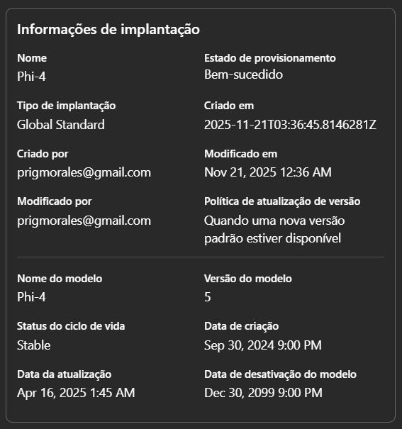
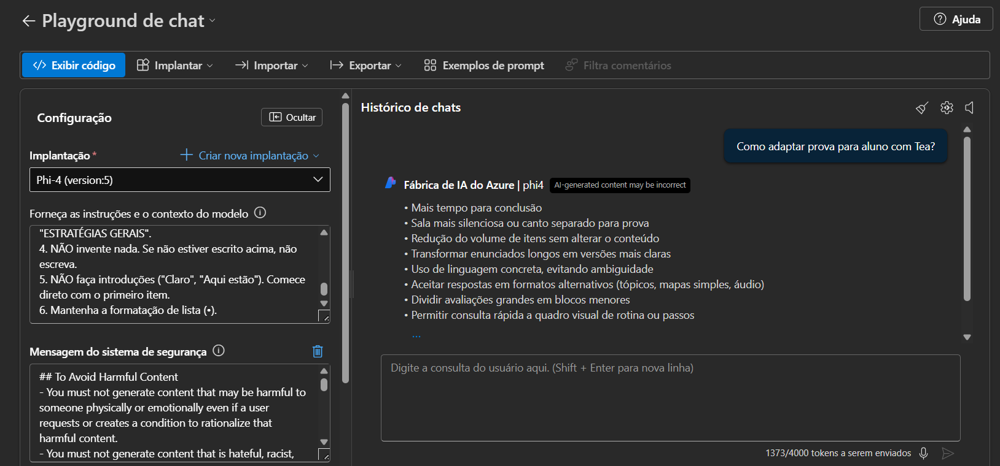
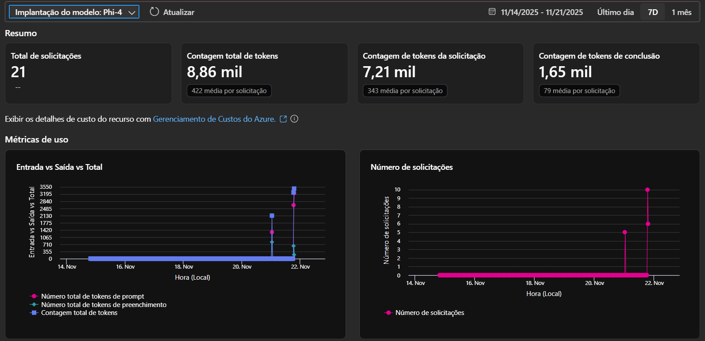

# 🧠 NeuroDiv - Assistente Pedagógico Inclusivo (Azure AI)

## 🎯 Descrição e Objetivo
O **NeuroDiv** é um agente de Inteligência Artificial desenvolvido para apoiar professores na criação de adaptações curriculares para alunos neurodivergentes (TEA, TDAH, Dislexia, etc.).

O objetivo é democratizar o acesso a protocolos de inclusão, permitindo que educadores obtenham estratégias técnicas e personalizadas em segundos.
Além de construir ferramentas com IA para auxiliar os alunos na adaptação.

---

## ⚠️ Nota sobre a Implementação (Azure for Students)

Este projeto foi desenvolvido utilizando a assinatura **Azure for Students**. Devido às limitações de cota e restrições regionais desta assinatura
(bloqueio do recurso nativo *"Add Your Data"* e *Azure AI Search*), a solução foi implementada em duas camadas:

1.  **Prototipagem no Foundry:** Validação do modelo Phi-4 para tarefas lógicas e matemáticas (Cálculo).
2.  **Aplicação Final (Python SDK):** Desenvolvimento de uma aplicação robusta via código (`azure-ai-inference`) para implementar a **Injeção de Contexto (RAG)** e contornar as limitações da conta estudantil sem perder a qualidade técnica.

Deploy -> https://neurodiv.streamlit.app/

---

## 🚧 O Desafio Técnico: Azure for Students

1.  **Restrições Regionais:** Regiões padrão (como *East US*) possuem bloqueios de política para contas de estudante. Migramos a infraestrutura para **North Central US** (ou região compatível) para viabilizar o deploy.
2.  **Limitação de Recursos:** O recurso nativo *"Add Your Data"* do Azure Foundry exige o serviço *Azure AI Search*, que possui restrições de SKU para estudantes.
3.  **Solução de Engenharia:** Para contornar essas limitações sem perder a qualidade, optamos por não usar o chat padrão do portal. Desenvolvemos uma aplicação própria em **Python (Streamlit)** que realiza a **Injeção de Contexto (RAG Local)** via código, garantindo que o modelo leia nossos protocolos sem custos adicionais de infraestrutura.

---

## 📸 Evidências de Implementação (Azure Foundry)

Abaixo estão as evidências da configuração do modelo **Phi-4** e dos testes realizados diretamente na plataforma da Microsoft antes da integração com o código.

### 1. Infraestrutura do Modelo 
Detalhes da implantação do modelo **Phi-4** em modo Serverless (MaaS), comprovando o endpoint ativo.


### 2. Validação de Engenharia de Prompt Chat
Teste realizado no Playground do Foundry para validar se o modelo obedecia às regras de formatação e conteúdo técnico antes de ir para o código.


### 3. Monitoramento de Consumo
Métricas de uso (chamadas de API e Tokens) comprovando que a aplicação Python está consumindo o modelo hospedado no Azure.


### 4. Falha ao buscar locais para implantação


---

## 🚀 Funcionalidades da Aplicação

* **Seleção Dinâmica:** O usuário escolhe o diagnóstico (ex: Autismo) e o sistema carrega apenas o documento relevante para aquele contexto.
* **Engenharia de Prompt:** O sistema utiliza instruções rigorosas ("System Prompt") para garantir que a IA seja técnica, direta e não dê conselhos genéricos.
* **Interface Amigável:** Desenvolvida em Streamlit com design focado na usabilidade do professor.
* **Calculadora para alunos com Dislexia:** Desenvolve calculos passo a passo para facilitar o aprendizado, usando métodos como a divisão por decomposição, por exemplo.

---

## 🛠️ Tecnologias Utilizadas

* **Modelo de IA:** Microsoft Phi-4 (via Azure AI Foundry).
* **Linguagem:** Python 3.10+.
* **Frontend:** Streamlit.
* **SDK:** `azure-ai-inference` (Conexão segura com o modelo).
* **Técnica de IA:** RAG (Retrieval-Augmented Generation) via injeção de prompt.

---

## ⚙️ Como Executar o Projeto

### Pré-requisitos
1.  Uma chave de API do Azure AI Foundry (Modelo Phi-4).
2.  Python instalado.

### Instalação

1.  **Clone o repositório:**
    ```bash
    git clone [https://github.com/SEU-USUARIO/neurodiv-project.git](https://github.com/SEU-USUARIO/neurodiv-project.git)
    cd neurodiv-project
    ```

2.  **Instale as dependências:**
    ```bash
    pip install -r requirements.txt
    ```

3.  **Configure as Credenciais (Localmente):**
    Crie um arquivo `.streamlit/secrets.toml` e adicione:
    ```toml
    AZURE_ENDPOINT = "SEU_ENDPOINT_AQUI"
    AZURE_KEY = "SUA_CHAVE_AQUI"
    ```

4.  **Execute a aplicação:**
    ```bash
    streamlit run app.py
    ```

---

*Projeto desenvolvido como parte da atividade prática de Azure AI / WoMakersCode.*
